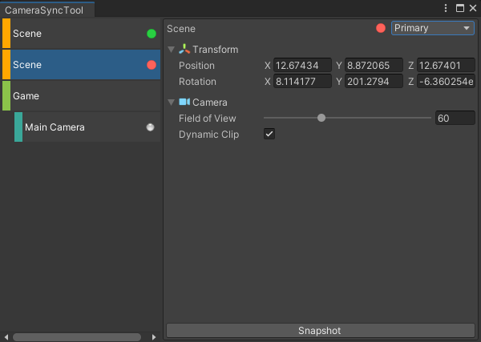
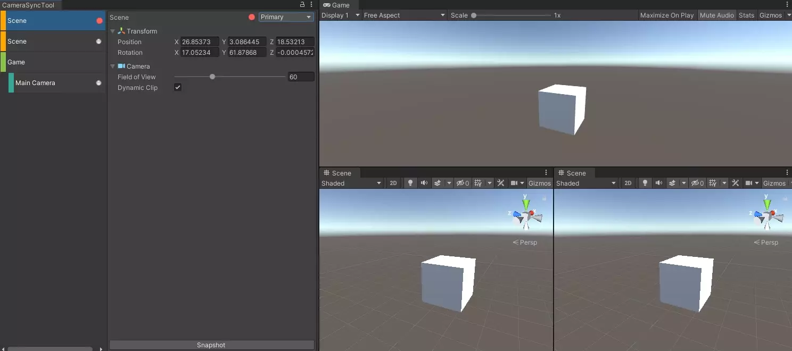

# UnityCameraSyncTool

Unity場景、遊戲攝影機同步，啟發自[Unity-Scene-Camera-Tool](https://github.com/ShirenY/Unity-Scene-Camera-Tool)

## 使用方法

+ 使用本專案或複製`Assets/CameraSyncTool`到你的專案

+ 從選單`Window/CameraSyncTool`開啟工具

    

+ 設定主要對象(Primary)和同步對象(同步對象)

    

## 相容性

目前僅測試過以下版本，但也可能兼容其他版本

| 版本
|------
| Unity 2018.4.x
| Unity 2020.3.x